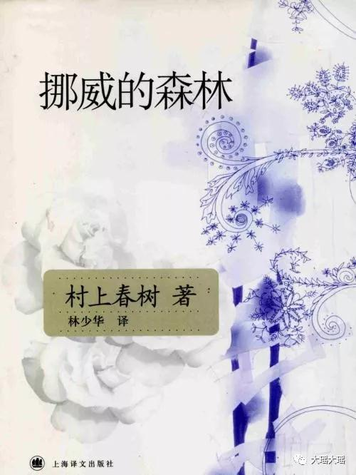
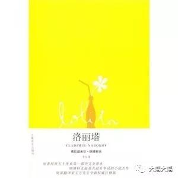

今年书单新鲜出炉，整体来说看得不多，感受不少。希望明年可以忙中抽闲多看一些。

还是按阅读的时间顺序来说。

## 嫌疑人X的献身 
###### - 东野圭吾
年初的时候东野圭吾的书除买了《嫌疑人X的献身》还买了《恶意》。

如果说《白夜行》当时看完对结局还是比较震撼（重点关注在了男主爸爸的奇怪的癖好）的话，如果说《解忧杂货店》是为走流量而写的话，实在是没有任何的创意和营养。

这本书故事情节还OK，杀人手法可以说是超级赞，但是这一切确实建立在让人实在是无法理解的感情之上。石神对一个刚见面的母女能产生那么浓厚的爱情甚至不惜为她犯下一起人命案，实在是无法理解。

整本书看完好比看了一集柯南，知道真相之后很多东西都不值得再次回味和推敲。估计《恶意》会放在很久以后再考虑看了。

## 岛上书店  
###### -（美）加布瑞埃拉·泽文
温馨的一本书，善念总是存于人心，里面安利了很多很多的书。主人公给捡来的女儿很多书单，网上也能找得到，其中有一本叫做《洛丽塔》的书我后来买来看。主人公喜欢短篇，很不喜欢长篇，我喜欢电影，很不喜欢连续剧。

## 万物有灵且美    
###### - （英）吉米·哈利
《万物系列》这是一本为了让我脾气性格变得更好的书，主人公和老婆住在乡下，是一个兽医，每天要奔跑很多农场给动物们看病，生活简单有时也匆忙，不一样的生活体验。

## 挪威的森林  
###### - 村上春树
不看永远不知道这是一本什么样的书，第一次被安利是臧昕给我讲的一本她最喜欢的作者写的她最喜欢的一本书。后来跟徐烨辰还交流过心得，的确一千个观众一千个哈姆雷特，但分享的确能让人意识到不一样的看事物的角度。

## 了不起的盖茨比   
###### - 弗·司各特·菲茨杰拉德
这本书是《挪威的森林》里面主人公最喜欢的一本书，男主也因为这本书认识了一个值得聊天的朋友。同时这本书也是村上春树最喜欢的书，所以就拿来看了。主要讲的是美国梦，有一篇心得写的很好.值得拿来一看。

后来看了小李子演的同名电影，完全复刻了小说中的细节，也是对原著的尊敬了。

## 平凡的世界（二，三） 
###### - 路遥
今年终于把整部书看完了，和前面的书穿插着看的。可以毫不保留的说，这将是对我影响最大的一部书，不论是看待事物，世事还是世间男男女女。在我看来他的书远比莫言书要好看的多，有影响力的多得多。

好书不必多说，重在体会。

## 洛丽塔  
###### - 弗拉基米尔·纳博科夫
这是我第一本放弃阅读的小说，大概看了有二十几页，因为实在难以接受以至于看不下去。这本是《岛上书店》的爸爸给自己姑娘的书单里的一本书。男主是在监狱里写下的这本回忆性质的书，却冠以这样可爱的书名。我想等我长大一些再回头来看吧。

## 消失的地平线  
###### - 詹姆斯·希尔顿
中英两版都买了。感触不多就两点： 对喇嘛的生活方式、传教方式等等都有了全新的感触，他们的适度原则感觉可以引用在现代的生活中加以感悟。香格里拉假假真真也看不清，像是桃花源记。第二点就是的一些毫不在意不紧不慢的态度会被一般人误解为是心有成竹有能力和魄力的表现，这一点值得思考。

## 人间失格  
###### - 太宰治
今年的最后一本书，也是看完以后有点生气的书，这本可能也要放在以后再次来读了。好评如潮的书，我在看了很多的书评，看了太宰治的生平之后好像有点儿理解，但这样人品的作家写出来的东西实在是无法理解。反正我看完以后把所有的日本系的书全部打包放起来了，简直无法忍受，还是文化差异太大？

现在开始看《生死疲劳》了，莫言脑洞太大还有点感叹还是路遥的作品更适合大众来读。我考虑着看完这本砖一样的书以后看看丹布朗的书吧。

2018年书单总结至此，愿2019再接再厉。

end 