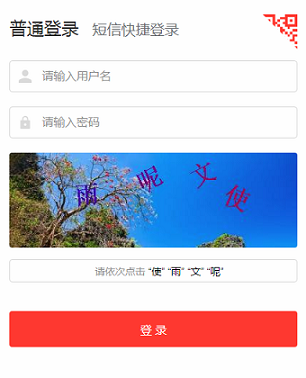

---

#### 前端运行效果图：


---
#### 安全方面：
  *  后端取随机背景图，随机汉字，随机位置，随机色值生成一张图传给前端
  *  后端将随机生成的汉字传给前端
  *  前端根据用户点击获取鼠标坐标，生成字符串，传给后端进行校验

---
####  代码片
  ##### Jsp （随后附上H5代码片）
```Html

<!--  图片点选汉字验证码  -->
	<section id="captcha_sec" class="input-container" style="display: none;" >
		<spring:message code="screen.welcome.label.captcha.accesskey"
			var="captchaAccessKey" />
		<input type="hidden" id="captchaHidenInputPart" name="captcha" value="" />
		<div style="width: 400px; height: 132px">
			"
			onclick="this.src='captcha.jpg?'+Math.random()" src="captcha.jpg"
			style="float: right; width: 400px; height: 132px; margin-top: 0px; left: 0; position: relative; border-radius: 4px;" />
		</div>
		
		<div cssClass="required login_input_2 loginInput captcha " cssErrorClass="error"
			id="captcha" size="25" tabindex="2" path="captcha" class="select_by_order"
			accesskey="${captchaAccessKey}" htmlEscape="true" autocomplete="off">
		</div>
		<div class="select_by_order required login_input_2 loginInput captcha" accesskey="screen.welcome.label.captcha.accesskey" style="border: 1px solid #DADADA;
  border-radius: 4px; display: block;" id="captcha">
                  请依次点击  <span id="forMousePos"></span>
        </div>
        <div class="select_by_order required login_input_2 loginInput captcha" style="border: 1px solid #DADADA; border-radius: 4px; display: none; background: #FFEEE1" id="selectFaildiv">
        	<i class="iconfont icon-cuowu-xiankuang" style="color: #FF0000">    校验失败，请重新校验</i>
        </div>
        <div class="select_by_order required login_input_2 loginInput captcha" style="border: 1px solid #DADADA; border-radius: 4px; display: none; background: rgba(152,251,152,0.3)" id="selectSuccessdiv">
        	<i class="iconfont icon-zhengque" style="color: #3CB371">    校验通过</i>
        </div>
	</section>
```

---

##### js
  前端获取坐标用了`offset()`函数。
  之前用的`client()`。二者的区别是，`offset()`获取的是当前元素的坐标，从而不需考虑滚动的位移值。
```JavaScript
<script type="text/javascript">
	$(document).ready(function () {
		var tenantId = $("#tenantId").val();
		var clientX, clientY, clientXY;
		var client = '';
		var attach_url = "";
		$.ajax({
			url: '',
			type: 'get',
			data: "tenant=" + tenantId,
			success: function (data, status) {
			}, 
			fail: function (err, status) {
				setDefaultImgsAndTitle();
			}
		});
		
		/* 返回汉字  */
        $.ajax({
          url: '',
          type: 'get',
          success: function(subData){
            //根据后端要求选择不同的拼接方式
          	subData="  “" + subData.data.substr(0, 1) + "” “" + subData.data.substr(2, 1) + "” “" + subData.data.substr(4, 1) + "” “" + subData.data.substr(6, 1) + "”";
          	 $("#forMousePos").text(subData);
          }, 
          fail: function(err,status){
       	 	 console.log()
          }
        });

		
		/* jquery 获取鼠标坐标函数 */
        function mousePos(e) {
          var x, y;
          var e = e || window.event;
          return {
            x: e.offsetX,
            y: e.offsetY
          };
        };
        
        var n = 0;
        $('#testMouseImg').on('click',function(e){
        	offsetX = mousePos(e).x;
        	offsetY = mousePos(e).y;
        	offsetXY = offsetX + "-" + offsetY;
        	coordinateToString(offsetXY); 
        	n++;
        	$('#testMouseImg').html(n);
        	if(n == 4){
        		client = client.substring(0,client.length-1);
        		/* 点击四次后传回坐标 */
        		$.ajax({
        	           url: '' + zzzz,
        	           type: 'get',
        	           success: function(data){
        	        	   if(data.status === "true"){
        	               	   $("#captcha").val(client);
        	               	   $("#captcha").attr("value",client);
        	               	   $("#captchaHidenInputPart").attr("value",client);
        	        		   console.log('校验成功  ',data.status);
        	        		   $("#captcha").text("验证通过   " );
        	        		   $("#selectSuccessdiv").css('display','block');
        	        		   $("#captcha").css('display','none');
        	               	   $("#selectFaildiv").css('display','none');
        	        	   } else {     		   
        	        		   console.log('校验失败 ',data.status); 
        	        		   $("#captcha").css('display','none');
        	               	   $("#selectFaildiv").css('display','block');
        	               	   $("#selectSuccessdiv").css('display','none');
        	        		   client = '';
        	        		   n = 0;
        	        		   $.ajax({
	        	        			url: '',
	                	           	type: 'get',
	                	           	success: function(){
	                	           		$('#testMouseImg').attr('src', '/cas/xxx.jpg');
	                	           	}
        	        		   });
        	        		   $.ajax({
        	        	            url: '',
        	        	            type: 'get',
        	        	            success: function(subData){
        	        		           	console.log(subData);
        	        		           	//根据后端要求选择不同的拼接方式
        	        		           	subData="  “" + subData.data.substr(0, 1) + "” “" + subData.data.substr(2, 1) + "” “" + subData.data.substr(4, 1) + "” “" + subData.data.substr(6, 1) + "”";
        	        		           	 $("#forMousePos").text(subData.data);
        	        	            }, 
        	        	       });
        	        	       //设置定时器
        	        		   setTimeout(function(){selectFaild()}, 1000);
        	        	   }
        	           },
        	           /* fail */
        	         });
        		console.log(client);
        	}
        })
        
        function coordinateToString(xy){
        	client = client + xy + "@";
    	}

        function setTimer(){
        	setTimeout(selectFaild(), 1000);
        }
        
        function selectFaild(){
        	$("#captcha").css('display','block');
        	$("#selectFaildiv").css('display','none');
        }
</script>     
```

---
#### JAVA
*  日志中打印出坐标，分别为：x, y, width, height
    
*  算法机制为：
    
    *
    *

---
Java部分
Github: https://github.com/YuyaoYan/captcha